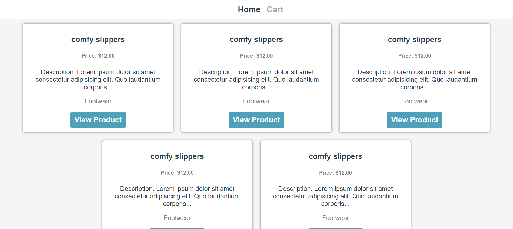

<br />
<p align="center">
  <h3 align="center">Vue.js Shopping Cart</h3>

  <p align="center">
    A simple shopping cart built for learning purposes
    <br />
    <a href="https://github.com/vanheaven-ui/vue-shopping-cart/pulls"><strong>Explore the docs »</strong></a>
    <br />
    <br />
    <a href="">View Demo</a>
    ·
    <a href="https://github.com/vanheaven-ui/vue-shopping-cart/issues">Request Feature</a>
  </p>
</p>

<details open="open">
  <summary>Table of Contents</summary>
  <ol>
    <li>
      <a href="#about-the-project">About The Project</a>
      <ul>
        <li><a href="#built-with">Built With</a></li>
      </ul>
    </li>
    <li>
      <a href="#getting-started">Getting Started</a>
      <ul>
        <li><a href="#prerequisites">Prerequisites</a></li>
        <li><a href="#setup">Setup</a></li>
        <li><a href="#installation">Installations</a></li>
        <li><a href="#run">Run</a></li>
      </ul>
    </li>
    <li><a href="#author">Author</a></li>
    <li><a href="#contributing">Contributing</a></li>
    <li><a href="#acknowledgements">Acknowledgements</a></li>
  </ol>
</details>

## About The Project



The application herein was built to practice the use of Vue.js to build front end applications. The main features of the application include viewing a list of items available, a drawer that displays the details of each item when the view details button is clicked, ability to add and remove items from the cart, and the cart view/page with details of items in the cart. [This youtube video](https://www.youtube.com/watch?v=oWt4jYThJCo) was the basis of the entire build and I would recommend it to any one that wants to practice some Vue.js. The next feature on the item is to build out an authentication so that several users can have different carts and profiles.

### Built With

Below is a list of the tools used to complete this application.

- [Vue](https://v3.vuejs.org/)
- [Vuex](https://vuex.vuejs.org/#what-is-a-state-management-pattern)

## Getting Started

To get a local copy up and running follow these simple example steps.

### Prerequisites

Ensure you have the following running in your local environment.

- npm
  ```sh
  npm install npm@latest -g
  ```
- NodeJs
  <br>

  [visit](https://nodejs.org/en/download/)

- Vue CLI
  <br>

  [visit](https://v3.vuejs.org/guide/installation.html#npm)

### 🔨 Setup

To get a copy of the project on your computer:

- Clone or download the repository to a local directory on your computer by following the Github instructions at [Github clone/download repository](https://docs.github.com/en/enterprise/2.13/user/articles/cloning-a-repository).

### 🛠 Installations <a name = "ins"></a>

Once you have a local copy of the entire project on your computer, then:

```
npm install
```

### Compiles and hot-reloads for development

```
npm run serve
```

### Compiles and minifies for production

```
npm run build
```

## ✒️ Author <a name = "author"></a>

👤 **Mworekwa Ezekiel**

- Github: [@vanheaven-ui](https://github.com/vanheaven-ui)
- Twitter: [@MworekwaE](https://twitter.com/MworekwaE)
- Linkedin: [@linkedin](https://www.linkedin.com/in/vanheaven/)
- Email: [ezekiel](mailto:vanheaven6@gmail.com)

## 🤝 Contributing

Contributions, issues and feature requests are welcome!

- To create an issue, visit the [issues page](https://github.com/vanheaven-ui/vue-shopping-cart/issues) and create a new issue.
- To contribute to the code base, follow the steps below:
  1. Fork this repository to your remote respository by clicking the Fork button in this repository.
  2. Clone this repository to a directory on your computer by following Github guidelines.
  3. Change directory into the directory where you cloned this repository to.
  4. Open the directory using your favorite editor.
  5. Create a feature branch off the develop branch.
  6. Make and commit the nuanced code.
  7. Open a pull request describing the improvements made
     And your reward awaits in heaven.

## 👍 Show your support

Give a ⭐️ if you like this project!

## :clap: Acknowledgements

- [Tyson London's Youtube Tutorial](https://www.youtube.com/watch?v=oWt4jYThJCo&t=3s) <br />
- [Vue official Documentation](https://v3.vuejs.org/)
